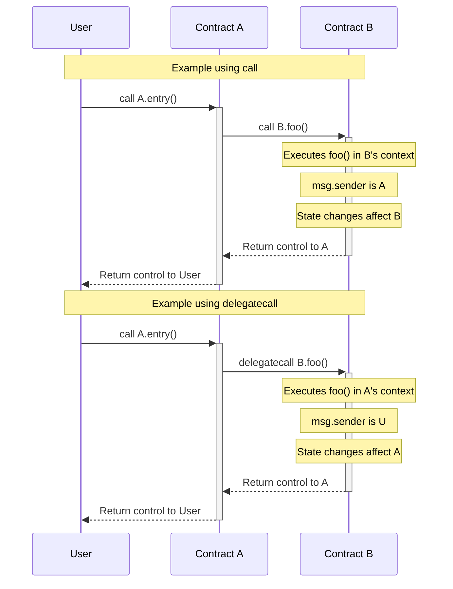
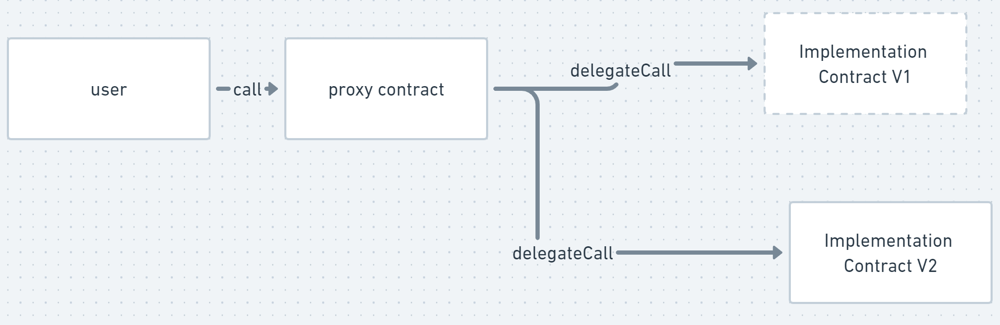
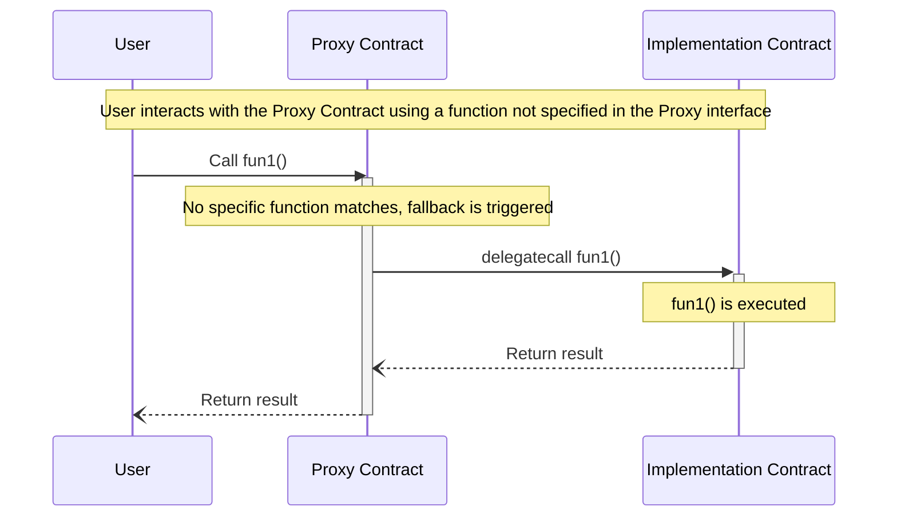

# Understanding the Principles of Smart Contract Upgradeability in Ethereum

## Why Contract Upgrade is Needed
In the context of Ethereum and smart contracts, contract upgradeability is needed due to the immutable nature of the blockchain. Once a smart contract is deployed, its code cannot be changed. This poses a challenge because bugs and vulnerabilities may be discovered in the contract after deployment, or business requirements may change over time necessitating changes in the contract's logic.

## Pros and Cons of Contract Upgrade
### Pros
1. Bug Fixes and improvements;
2. Adaptability;

### Cons
1. Centralization Risks
The ability to upgrade a contract often means that someone has the authority to make those changes, which introduces a degree of centralization and requires trust in that authority.

2. Added Complexity
   
## Prerequisite Knowledge
### call and delegateCall
Before we discuss contract upgrades, we need to understand the two important methods: call and delegatecall.
**call**: When contract A calls contract B using call, the code of contract B is executed in the context of B. That means msg.sender and msg.value in contract B will be the caller of contract A, and it will access the state storage of contract B.

**delegatecall**: When contract A calls contract B using delegatecall, the code of contract B is executed in the context of A. That means msg.sender and msg.value in contract B will be the original sender and value, and it will access the state storage of contract A.



## Upgrade Principles
### Using Proxy Contracts

Here is a simplified version of a proxy contract:
```solidity
contract Proxy {
    address public implementation;
    address public admin; 

    constructor(address _implementation){
        admin = msg.sender;
        implementation = _implementation;
    }

    fallback() external payable {
        (bool success, bytes memory data) = implementation.delegatecall(msg.data);
    }

    function upgradeTo(address newImplementation) external {
        require(msg.sender == admin);
        implementation = newImplementation;
    }
}
```


### Using fallback for Unified Delegation
```solidity
contract Proxy {
    ...
    fallback() external payable {
        (bool success, bytes memory data) = implementation.delegatecall(msg.data);
    }
}
```

```solidity
contract Implementation1 {
    address public implementation; 
    address public admin; 

    function fun1() public{

    }
s
    function fun2() public{

    }
        
}
```


### Initialization
In upgradeable contracts, it's recommended to use a separate initialize function for initialization rather than the constructor. This is due to the way proxy contracts work.

When a proxy contract is used, the constructor of the implementation contract is not called. This is because the constructor is only called when the contract is first created and deployed to the blockchain, and with a proxy contract, the implementation contract is not the contract that's actually deployed.

Instead, the proxy contract is deployed and it delegates calls to the implementation contract. Because of this, the constructor of the implementation contract is not called, and any initialization that needs to happen must occur in a separate initialize function.

This initialize function is then called after the contract is deployed, and it can be structured in a way to ensure that it can only be called once, similar to a constructor.

### General Contract Upgrade
#### UUPS and Transparent Proxy